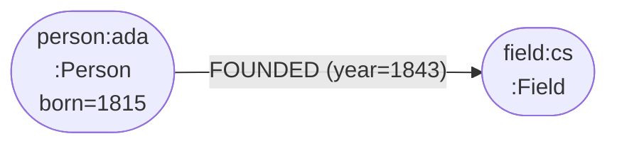
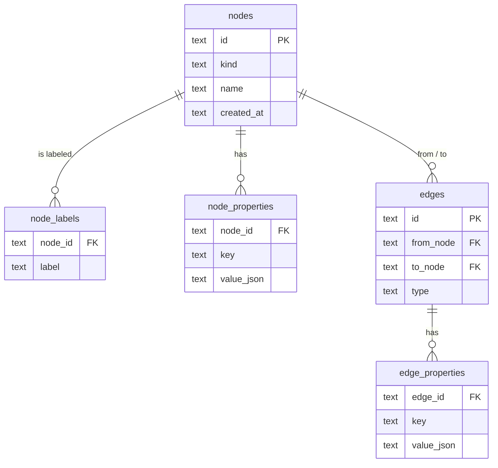
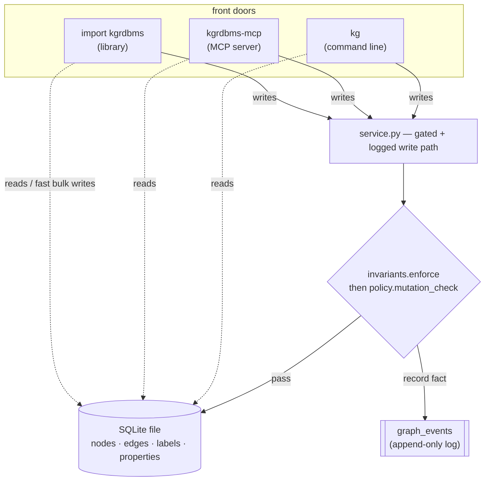
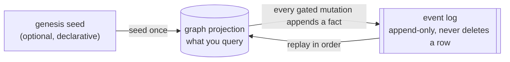
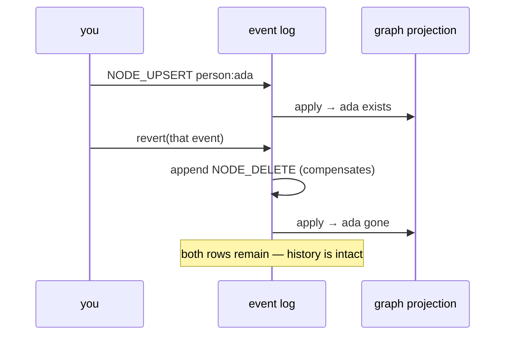

# knowledge-graph-rdbms

**A lightweight, transparent, event-sourced knowledge graph that lives in a single SQLite file.**

No graph database. No Cypher. No server, no JVM, no Docker. Five tables, a
small Python API, and — if you want it — an [MCP](https://modelcontextprotocol.io)
server and a `kg` command line. The core library has **zero third-party
dependencies**.

> Python 3.10+ · MIT · zero-dependency core · library + CLI + MCP

This is a niche tool, not a product. It exists for people who want a knowledge
graph backend they can fully understand, embed anywhere, and reason about — and
who don't want to stand up Neo4j to store a few hundred thousand facts.

---

## Contents

- [Is this for you?](#is-this-for-you)
- [The idea in 30 seconds](#the-idea-in-30-seconds)
- [Design philosophy](#design-philosophy)
- [The data model](#the-data-model)
- [Architecture: three front doors, one engine](#architecture-three-front-doors-one-engine)
- [Event sourcing: the graph is a projection](#event-sourcing-the-graph-is-a-projection)
- [The safety gate: invariants vs. policy](#the-safety-gate-invariants-vs-policy)
- [Install](#install)
- [Quickstart](#quickstart)
- [Performance](#performance)
- [Command reference](#command-reference)
- [Project layout](#project-layout)
- [Development](#development)
- [License](#license)

---

## Where it fits

It's built for graphs you want to **own completely** — small enough to inspect,
fast enough to embed, transparent enough to trust:

- **Embedded ontologies** — a knowledge graph that ships inside a single app or
  service, in one file you can copy and version.
- **Agent & assistant memory** — facts an AI can read and write over MCP, with a
  full audit trail and one-command rollback.
- **Declarative datasets** — describe your base graph as YAML/JSON facts and
  replay them into a queryable graph, deterministically.
- **"SQLite, but my data is a graph"** — the moment relational rows start
  describing relationships, this is their natural home.

The design center is **read-heavy, single-writer, up to low millions of
nodes** — the same sweet spot as SQLite itself: one file, in-process, no server
to run. That covers a surprising amount of real work. For workloads past that
center, [Performance](#performance) maps out exactly where the curve bends and a
purpose-built graph engine starts to earn its extra moving parts.

---

## The idea in 30 seconds

A **label property graph** needs only four primitives:

| Primitive    | What it is                                            |
| ------------ | ----------------------------------------------------- |
| **Node**     | a stable id, a `kind`, a display `name`               |
| **Edge**     | a typed, directed relationship between two nodes      |
| **Label**    | set memberships on a node (many per node)             |
| **Property** | a JSON-valued key/value bag on a node *or* an edge    |

Store those in SQLite, add a few indexes, and you have a knowledge graph.
Everything else in this project — traversal, an append-only history, a safety
gate, the CLI, the MCP server — is built on top of those four facts.

```python
from kgrdbms import Graph

with Graph(path="demo.db") as g:
    g.add_node("person:ada", kind="Person", name="Ada Lovelace",
               labels={"Person"}, properties={"born": 1815})
    g.add_node("field:cs", kind="Field", name="Computer Science")
    g.add_edge("person:ada", "field:cs", "FOUNDED", properties={"year": 1843})

    print(g.shortest_path("person:ada", "field:cs"))
```



---

## Design philosophy

**1. Boring storage is a feature.** SQLite already solved durability,
transactions, indexes, and recursive queries. We don't reinvent any of it. One
file, copy it to back it up, open it with any SQLite tool to inspect it.

**2. The schema fits on a screen.** Five tables, no surprises. You can read the
entire storage layer and know exactly where every fact lives. Legibility beats
cleverness.

**3. The state is a pure function of data.** What you query is a *projection*.
The source of truth is an append-only log of facts plus an optional declared
seed. Your whole graph is reproducible: `state = replay(seed + log)`. That one
property buys audit, undo, and time-travel for free.

**4. Mutation is gated, and the gate has two layers.** When you let an agent
rewrite your graph over a wire, you need rules. Some rules are *configurable*
(policy); some must be *un-negotiable* (compiled-in invariants). We separate
mechanism from policy on purpose.

**5. One engine, many doors.** A library call, a `kg` command, and an MCP tool
all flow through the same gated, logged write path into the same file. There is
no "CLI version" of the truth and "MCP version" of the truth — there's one.

**6. Pay for speed only when you ask.** Every single write commits on its own
(safe by default). Bulk paths (`batch()`, `add_nodes`, `add_edges`) let you opt
into ~10× throughput when you mean to.

---

## The data model

The graph is five tables. That's the whole storage layer.



Design notes that matter:

- **Edges are unique on `(from_node, type, to_node)`.** Re-adding the same
  triple updates its properties instead of duplicating it. Idempotent by
  construction.
- **Properties are JSON.** Values round-trip as whatever JSON type you store —
  ints, bools, lists, nested objects.
- **Foreign keys cascade.** Delete a node and its labels, properties, and
  incident edges go with it, enforced by SQLite.
- **`slug()` deduplicates natural-language ids.** Two strings that slugify the
  same become the same node — the load-bearing trick for turning prose concepts
  into stable ids.

A sixth table, `graph_events`, holds the append-only history (see below). It
shares the same file and connection.

---

## Architecture: three front doors, one engine



The CLI, the MCP server, and your own Python code all mutate through
`service.py`, so the safety gate and the event-log bookkeeping exist in exactly
one place and can't drift between front doors.

The gate resolves `invariants.enforce` and `policy.mutation_check` *through
their modules at call time* — so editing your policy (or monkeypatching it in a
test) takes effect across every door at once.

> The library also has a **direct, fast, unlogged** path (`g.add_node(...)`,
> `g.add_nodes(...)`). It's the right tool for bulk loading, but those writes
> are not in the event log — see the warning under *Event sourcing*.

---

## Event sourcing: the graph is a projection

The graph you query is a cache. The **append-only event log is the source of
truth.** Every gated mutation records a reversible fact.



Because the log never loses a row, you get three things at once:

- **Audit is archaeology.** Every change is timestamped and attributed to an
  actor. `kg events` tails the history.
- **Undo is an event, not a delete.** `compensate()` (CLI: `kg revert <id>`)
  emits the *inverse* event. The original row stays; you can see that it was
  reverted and by what.
- **Time travel.** `replay(upto_ts=...)` rebuilds the projection as of any past
  instant.



### Two write paths, by design

You choose how each write relates to history:

- **Logged path** — the CLI, the MCP server, and `service.*`. Every mutation is
  gated and appended to the log, so it's audited, reversible, and reproduced
  exactly by `replay()`. This is the path you want when the timeline *is* the
  truth.
- **Direct path** — `g.add_node`, `g.add_nodes`, `g.batch()`. Writes go straight
  to the projection: the fastest way to bulk-load or stage data. They aren't in
  the log, so `replay()` (which rebuilds from the log) won't include them.

Pick per workload: direct for raw loading speed, logged when you need the
history. And you can have both — `kg import` runs the logged path *inside* a
single `batch()`, so a bulk load is fast **and** fully recorded.

The replay seed is just a callable, so you can declare your base graph in
YAML/JSON and re-seed deterministically before the logged deltas are applied:

```python
from kgrdbms import Graph, EventLog, replay

def genesis(g):
    # re-create your declared base facts (e.g. parsed from YAML)
    g.add_node("root", kind="Root", name="root")

replay(graph, events, genesis=genesis)              # rebuild from seed + log
replay(graph, events, genesis=genesis, upto_ts=ts)  # ...as of an instant
```

---

## The safety gate: invariants vs. policy

When you expose the graph for live mutation — especially to an AI agent over
MCP — "who is allowed to change what" becomes a real question. The answer here
is two layers, and the order matters.


- **`invariants.py` is mechanism.** Rules here are enforced in code, ahead of
  policy, and cannot be turned off by configuration or talked around over the
  wire. Changing one is a code change and a redeploy. The default enforces
  nothing — invariants are inherently domain-specific.
- **`policy.py` is configuration.** A single `mutation_check(ctx) -> Decision`
  function. The default is permissive (everything allowed). Edit it to seal the
  parts that must not change. Five to ten lines is usually enough.

Invariants run **first**, so a permissive (or compromised) policy can never
re-open something an invariant has sealed. That's the whole reason to separate
them.

```python
# policy.py — append-only example: callers may add, never delete or modify
def mutation_check(ctx):
    if ctx.operation in {"node_delete", "edge_remove", "graph_clear"}:
        return Decision.deny("policy is append-only; no deletions")
    return Decision.allow()
```

---

## Install

```bash
pip install knowledge-graph-rdbms            # core library + the kg CLI
pip install "knowledge-graph-rdbms[mcp]"     # + the MCP server
```

Or, to get the `kg` / `kgrdbms-mcp` commands on your PATH globally
([uv](https://docs.astral.sh/uv/) or [pipx](https://pipx.pypa.io/)):

```bash
uv tool install "knowledge-graph-rdbms[mcp]"
# or, from a local checkout, editable:
uv tool install --editable "/path/to/knowledge-graph-rdbms[mcp]"
```

Storage defaults to `~/.kgrdbms/graph.db`. Override with the `KGRDBMS_HOME`
environment variable, or per-command with `kg --db PATH`, or in code with
`Graph(path=...)`.

---

## Quickstart

### As a library

```python
from kgrdbms import Graph

with Graph(path="demo.db") as g:
    g.add_node("person:ada", kind="Person", name="Ada Lovelace", labels={"Person"})
    g.add_node("field:cs", kind="Field", name="Computer Science")
    g.add_edge("person:ada", "field:cs", "FOUNDED", properties={"year": 1843})

    for edge, target in g.out("person:ada"):
        print(edge.type, "->", target.name)
    print(g.shortest_path("person:ada", "field:cs"))
```

**Bulk loading** — every single write commits on its own (one fsync each), so
for bulk work opt into one transaction and go ~10× faster:

```python
# fastest: executemany under a single commit
g.add_nodes([
    {"id": "person:ada", "kind": "Person", "name": "Ada", "labels": ["Person"]},
    {"id": "field:cs", "kind": "Field", "name": "Computer Science"},
])
g.add_edges([("person:ada", "field:cs", "FOUNDED")])  # dicts / Edge objects work too

# or batch() — defer commits for any mix of writes, atomic rollback on error
with g.batch():
    for spec in many_specs:
        g.add_node(**spec)
```

### As a CLI

The `kg` command ships with the core install (stdlib `argparse`, no extra
deps). Reads hit the graph directly; **writes go through the same gate + event
log as the MCP server**, so `kg replay` / `kg revert` work and a custom policy
is honored at the console too.

```bash
kg node add person:ada --kind Person --name "Ada Lovelace" \
    --label Person --prop born=1815 --prop fields='["math","cs"]'
kg node add field:cs --kind Field --name "Computer Science"
kg edge add person:ada field:cs FOUNDED --prop year=1843

kg out person:ada                 # outbound edges
kg path person:ada field:cs       # shortest path
kg nodes-by-kind Person
kg stats
kg --json node get person:ada     # machine-readable output for piping

kg events -n 10                   # tail the event log
kg revert <event-id>              # undo a mutation (compensating event)
kg replay                         # rebuild the projection from the log

kg import graph.json              # bulk {nodes, edges} import (gated + logged)
kg serve                          # launch the MCP server (needs [mcp])
```

`--prop key=value` values are parsed as JSON when possible (`born=1815` → int,
`ok=true` → bool, `tags='["a"]'` → list) and kept as a plain string otherwise.
Exit codes: `0` ok · `1` not found / bad input · `2` policy denial · `3`
invariant violation.

### As an MCP server

```bash
pip install "knowledge-graph-rdbms[mcp]"
claude mcp add kgrdbms -- kgrdbms-mcp          # register with Claude Code
```

Or hand-edit a client config (e.g. Claude Desktop):

```json
{ "mcpServers": { "kgrdbms": { "command": "kgrdbms-mcp" } } }
```

It exposes `kg_`-prefixed tools for reads (`kg_node_get`, `kg_nodes_by_kind`,
`kg_neighborhood`, `kg_shortest_path`, `kg_descendants`, …), gated writes
(`kg_node_upsert`, `kg_edge_add`, `kg_node_delete`, …), and the event log
(`kg_events_tail`, `kg_event_revert`, `kg_replay`). Every write passes through
the invariants + policy gate and is recorded — same engine, same file as the
CLI.

---

## Performance

Numbers below are from `bench.py` on Apple Silicon with SQLite in WAL mode —
illustrative, not a guarantee. The shape is what matters.

| Operation                          | Throughput       |
| ---------------------------------- | ---------------- |
| `node(id)` point lookup            | ~113,000 / s     |
| `out()` traversal                  | ~82,000 / s      |
| `shortest_path` (1,000 hops)       | ~18 ms           |
| `add_node` (default, commit/call)  | ~17,000 / s      |
| `add_node` inside `batch()`        | ~161,000 / s     |
| `add_nodes([...])` bulk            | ~202,000 / s     |
| `add_edges([...])` bulk            | ~144,000 / s     |

Two things worth knowing:

- **Durable by default, fast on demand.** Each single write commits on its own
  for durability (~15–20k writes/s). When you're loading in bulk, `batch()` /
  `add_nodes` / `add_edges` collapse those commits into one transaction for an
  ~10× jump (~150–200k writes/s) — same engine, you just tell it a batch is
  coming.
- **Multi-node reads stay flat.** `nodes_by_kind`, `nodes_by_label`,
  `descendants`, `neighborhood`, and `out()`/`in_()` hydrate labels and
  properties for the whole result set in a constant number of queries rather
  than two per row, so a 20k-node read doesn't fan out into 40k follow-up
  queries.

### Where the curve bends

Queries compile to SQL over B-tree indexes, so each traversal hop is an index
lookup. That's wonderfully cheap for point reads and shallow traversals — and
it's why an embedded SQLite graph beats a networked graph server outright for
small, frequent operations: no protocol, no round-trip, no JVM warmup, just a
function call into the same process.

A purpose-built engine (Neo4j and friends) starts to pull ahead when the
*workload* — not just the row count — shifts toward:

- **Deep, high-fan-out traversal.** Index-free adjacency follows direct pointers
  between nodes, so a 6-hop walk across a densely connected graph sidesteps the
  per-hop index lookups SQL repeats.
- **Complex pattern matching.** A Cypher planner optimizes multi-pattern queries
  in ways a fixed traversal API doesn't attempt.
- **Concurrent writers and scale-out.** Single-file SQLite is one writer at a
  time; clustered engines aren't.

Rule of thumb: read-heavy and shallow up to low millions of nodes is firmly home
turf; traversal- or pattern-heavy past tens of millions is where a dedicated
engine earns its complexity. The crossover is workload-shaped, not a single
magic number — so the honest move is to benchmark your shape.

---

## Command reference

| Command                         | What it does                                  |
| ------------------------------- | --------------------------------------------- |
| `kg stats`                      | node/edge counts and db path                  |
| `kg node add ID --kind K …`     | create or update a node (gated + logged)      |
| `kg node get ID`                | fetch a node                                  |
| `kg node del ID`                | delete a node (cascades edges)                |
| `kg node set-prop ID KEY VAL`   | set one property                              |
| `kg node add-label ID LABEL`    | add a label                                   |
| `kg edge add FROM TO TYPE`      | add an edge                                   |
| `kg edge rm FROM TO TYPE`       | remove an edge                                |
| `kg nodes-by-kind KIND`         | list nodes of a kind                          |
| `kg nodes-by-label LABEL`       | list nodes with a label                       |
| `kg out ID [--type T]`          | outbound edges                                |
| `kg in ID [--type T]`           | inbound edges                                 |
| `kg path FROM TO`               | shortest undirected path                      |
| `kg neighbors ID [--depth N]`   | nodes within N hops                           |
| `kg descendants ID TYPE`        | nodes reachable along one edge type           |
| `kg events [-n N]`              | tail the event log                            |
| `kg revert EVENT_ID`            | undo an event (compensating event)            |
| `kg replay [--upto TS]`         | rebuild the projection from the log           |
| `kg import FILE`                | bulk `{nodes, edges}` import (gated + logged) |
| `kg serve [--transport T]`      | run the MCP server                            |

Add `--json` to any command for machine-readable output; `--db PATH` to target
a specific database.

---

## Project layout

```
kgrdbms/
├── graph.py        # the label property graph over SQLite (no internal deps)
├── events.py       # append-only event log: record, compensate, replay
├── policy.py       # configurable mutation policy (permissive by default)
├── invariants.py   # compiled-in invariants, checked before policy (no-op default)
├── service.py      # the shared gated + logged write path
├── cli.py          # the `kg` command (stdlib argparse)
└── mcp_server.py   # the MCP server (optional [mcp] extra)
```

`graph.py` imports nothing internal — it's a usable, dependency-free LPG on its
own. Everything else layers on top.

---

## Development

```bash
git clone <repo> && cd knowledge-graph-rdbms
uv venv && uv pip install -e ".[dev]"
pytest                 # 54 tests
python bench.py        # performance probe
```

---

## License

MIT.
