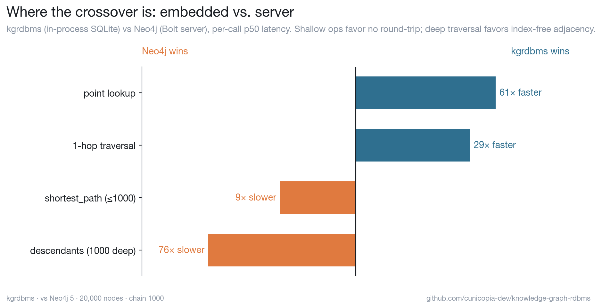

# kgrdbms vs Neo4j — head-to-head

An honest comparison of an **embedded** SQLite label property graph against a
real **server** graph database, on an identical graph with identical queries.
The goal isn't to declare a winner — it's to find the *crossover*.

## The result



On 20,000 nodes (per-call p50 latency):

| operation               | kgrdbms (in-process) | Neo4j (Bolt server) | verdict          |
| ----------------------- | -------------------: | ------------------: | ---------------- |
| point lookup            |               ~7 µs |             ~450 µs | **61× faster**   |
| 1-hop traversal         |              ~15 µs |             ~415 µs | **29× faster**   |
| shortest_path (≤1000)   |             ~5.9 ms |             ~640 µs | 9× slower        |
| descendants (1000 deep) |            ~51.7 ms |             ~680 µs | **76× slower**   |

**Read Neo4j's column:** it's nearly flat (~0.4–0.7 ms) for *everything*,
because the Bolt round-trip dominates — the actual graph work is cheap on top of
it. kgrdbms has no round-trip (7 µs floor), so it wins shallow, frequent ops by
1–2 orders of magnitude. But a deep variable-length walk *computes* — kgrdbms
does it as a recursive SQL CTE plus row hydration, while Neo4j pointer-chases via
index-free adjacency. **The crossover is the point where graph-computation cost
exceeds network-round-trip cost.**

The takeaway is the same one in the main README's *Where the curve bends*: an
embedded graph is the right tool for agent-shaped workloads (lots of small,
shallow reads and writes, no server to run), and a purpose-built engine earns
its complexity for deep-traversal or pattern-heavy work at scale.

## Reproduce it

Needs Docker and the Neo4j Python driver (`pip install neo4j`).

```bash
# 1. start Neo4j 5 (community) in Docker
docker run -d --name kg-neo4j -p 7474:7474 -p 7687:7687 \
    -e NEO4J_AUTH=neo4j/benchpass neo4j:5-community

# 2. wait ~20s for it to boot, then run the head-to-head
python bench/neo4j/headtohead.py                       # table
python bench/neo4j/headtohead.py --scale 50000 --json > temp/neo4j.json

# 3. render the crossover chart from that JSON
python bench/charts.py --neo4j temp/neo4j.json --only-neo4j

# 4. tear it down
docker rm -f kg-neo4j
```

Connection is configurable via `NEO4J_URI`, `NEO4J_USER`, `NEO4J_PASSWORD`.

## Fairness notes

- Both engines load the **same** seeded graph and run the **same** logical
  queries, each measured identically (warmup, then per-call latency, p50/p90/p99).
- Neo4j gets a uniqueness **constraint/index** on the id, parameterized queries
  (so the plan cache is warm), and `UNWIND`-batched loads — i.e. it's tuned, not
  sandbagged.
- kgrdbms runs in-process; Neo4j runs over Bolt to localhost. That round-trip is
  inherent to the server model — measuring it *is* the experiment, not a thumb on
  the scale. A remote Neo4j would only widen the shallow-op gap.
- Single machine, single client. This measures latency, not Neo4j's real
  strengths (concurrency, clustering, huge-graph analytics).
